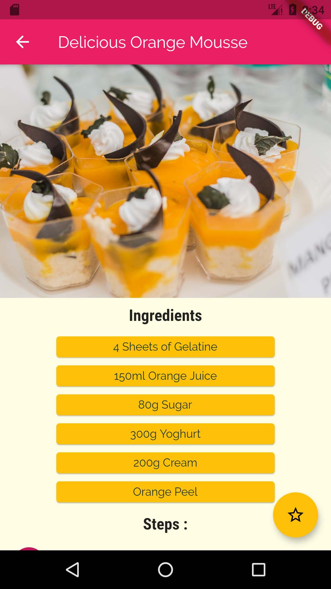

# Meal App  

-Have you ever founded your self not knowing what to make for dinner ? well this app is made for you.
You can find many great foods with detailed recepies in this app, with ability to filter them based on your likings and dislikings 

-Implemented with Flutter and Dart 

Disclaimer : The idea of the project and the orginal code is not mine. I just coded along with a course taught by Maximilian Schwarzmüller on udemy, which you can find a link to it down below :

https://www.udemy.com/course/learn-flutter-dart-to-build-ios-android-apps/

Here are some screenshots of the app : 

                              
        
